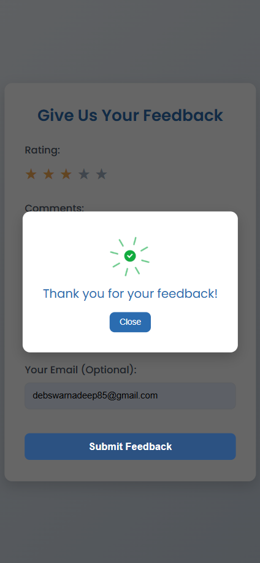

# Feedback Form Prototype

A sleek and professional feedback form designed for user engagement. This form allows users to provide ratings, comments, and suggestions in an intuitive and visually appealing interface.

## 🌟 Features

### 1. **Interactive Rating System**
- Users can select a rating (1-5 stars) by clicking on star icons.
- Stars highlight dynamically to show the selected rating.

### 2. **User-Friendly Input Fields**
- Fields for comments, suggestions, and email (optional).
- Input fields highlight on focus for better visibility.

### 3. **Dynamic Submit Button**
- Disabled until a rating is selected to prevent incomplete submissions.

### 4. **Confirmation Modal**
- A pop-up modal appears on successful submission.
- Displays a success message with a GIF for a positive user experience.

### 5. **Responsive Design**
- Fully responsive layout, adapts to any screen size (mobile, tablet, desktop).

---

## 🚀 Technologies Used

- **HTML**: For the structure of the form.
- **CSS**: For styling and animations.
- **JavaScript**: For interactivity and functionality.

---

## 🛠️ Setup Instructions

1. Clone the repository:
   ```bash
   git clone https://github.com/SwarnadeepDeb/-interactive-feedback-form.git
   ```
2. Navigate to the project folder:
   ```bash
   cd -interactive-feedback-form
   ```
3. Open the `index.html` file in your browser to view the feedback form.

---

## 🎨 Color Palette

| Color                | Usage                  |
|----------------------|------------------------|
| **#f9fafb**          | Background of inputs   |
| **#4f46e5 (blue)**   | Accent colors and buttons |
| **#ffcc00 (yellow)** | Active stars           |
| **#f3f4f6 to #e0e7ff** | Gradient background  |


## 📷 Screenshots

### Feedback Form


---

## 🤝 Contributing

Contributions are welcome! If you have ideas for improvements or new features:
1. Fork the repository.
2. Create a new branch for your feature:
   ```bash
   git checkout -b feature-name
   ```
3. Commit your changes and push the branch.
4. Submit a pull request.

---


## 💬 Feedback

We'd love to hear your thoughts on this prototype! Feel free to open an issue or reach out with suggestions.

---